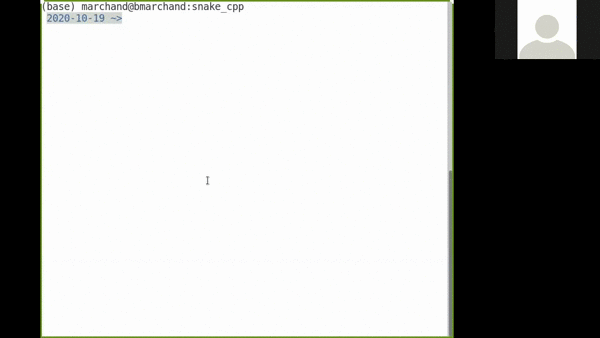

# SNAKE C++

## A l'issue de la séance 

L'objectif est qu'à l'issue de la séance vous-soyez capable de jouer à Snake comme illustré ci-dessous. 



## Pré-requis 

Pour réaliser cet exercice il a volontairement été choisi de réaliser un programme excessivement simple, si si je vous promets c'est simple. 

Cela se traduit par : 

* Uniquement des structures de données standard `std::vector`, `std::array` et `std::tuple`
* Pas de dépendances externes, la partie graphique se fait uniquement dans le terminal à coup de `std::cout` et de `clear`

Étant d'une grande mansuétude je vous ai préparé un squelette de code : 

Dans le dossier `src` les fichiers `.cpp` contenant un certain nombre de fonctions utilitaires que j'ai faites pour vous. Dans le dossier `include` les headers files associés. Vous trouverez également un fichier `makefile` s'occupant de la chaîne de compilation pour vous. 

## Travail à faire 

Alors oui pour avoir le droit de jouer au Snake il va falloir que vous vous bougiez un peu !! 

Dans le dossier que vous venez de cloner vous avez un fichier `main.cpp` c'est le point d'entré de notre programme. Dans ce fichier vous trouvez une fonction `main` et une fonction `startGame`. Ces deux fonctions sont déjà implémentées pour vous pas besoin d'y toucher. 

En revanche .... ces fonctions appellent elles-même d'autre fonctions comme vous pouvez le voir qui elles ne sont pas implémentées. Donc vous me voyez venir c'est à vous d'implémenter les fonctions manquantes. 

Enjoy !! 


### Bon ok je suis sympa je vous aide 

Du coup pour que vous puissiez vous en sortir avec toutes ces fonctions à définir il faut déjà que vous compreniez le fonctionnement général du programme. 

Le programme comporte deux tableaux que l'on se trimballe partout : 
* `std::vector<std::pair<int,int>>` c'est le tableau définissant la position du serpent
* `std::vector<int> ` c'est le tableau définissant le "terrain de jeu"

Il s'agit de tableau unidimensionel qui nous permettent de stocker des valeurs 2D `(x, y)`. 
Le tableau `background` contient les valeurs associées à chaque point de la grille `nx*ny`. Pour accéder à l'élement `(i,j)` avec `i` l'indice des abscisses et `j` l'indice des ordonnées la relation est la suivante : 

$$val_{ij} = background[ i + j*nx ]$$

Tandis que le tableau `snake` permet de stocker la position `(x,y)` de chaque élément du serpent. Pour obtenir les coordonnées `(x,y)` du `i`-ème élément du serpent il suffit de faire (merci le C++17): 

```c++
auto [x,y] = snake[i];
```


